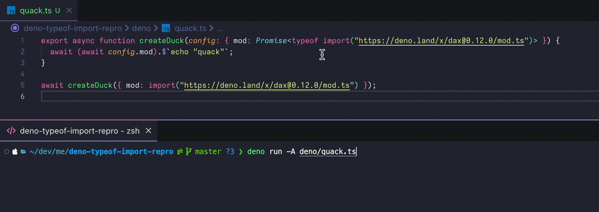

# Deno `typeof import()` repro

VSCode tooltip removes the `.ts` extension from a `typeof import()` in certain conditions. Functionally everything seems to work but it's a bit confusing.

See [quack.ts](./deno/quack.ts) for the source file.

---

